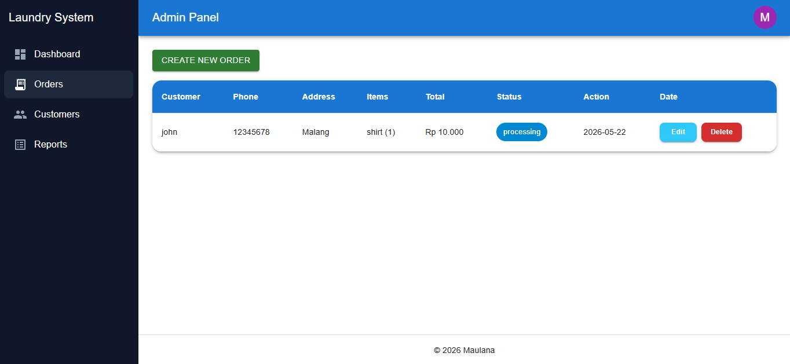
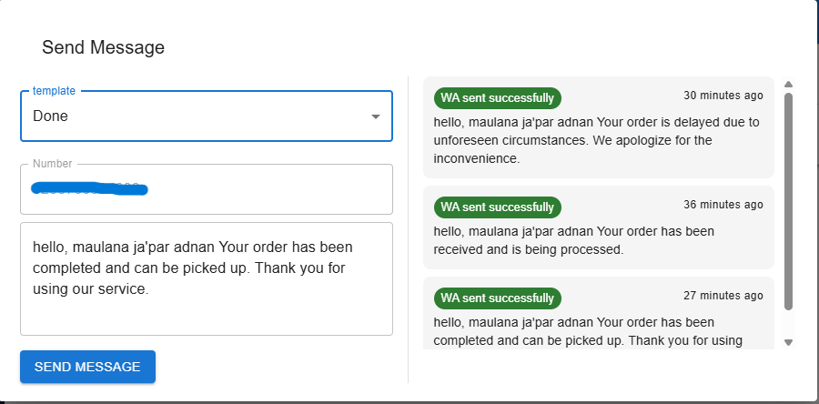
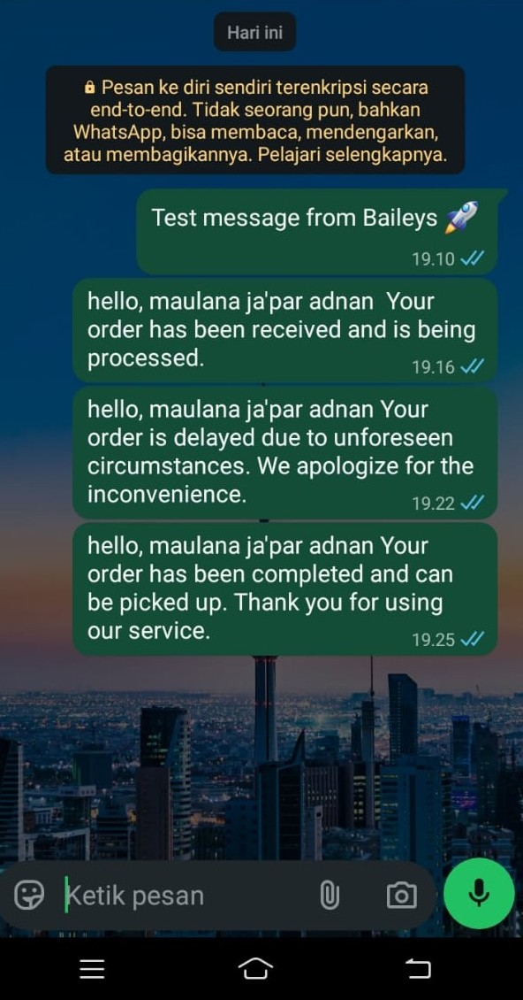

# Laundry Management System with WhatsApp Notifications

A simple fullstack application for managing laundry orders with automated WhatsApp notifications using Baileys.

---

## 🚀 Features

- Create and manage laundry orders
- Update order status
- Automatic WhatsApp notifications
- Admin panel interface with navigation
- WhatsApp message logs

---

## 🧠 Tech Stack

**Frontend:**

- React.js (Vite) with **TypeScript**
- **Material-UI (MUI)** & `mui-tel-input` for Admin Design and Order Management UI

**Backend & Database:**

- Node.js & Express.js (ES Modules)
- **Firebase Firestore** (NoSQL Database)

**WhatsApp Integration:**

- `@whiskeysockets/baileys` (WhatsApp Web API Wrapper)

---

## 📸 Demo

### 🖥️ Admin Panel & Order List



### 📱 WhatsApp Notification Received




---

## ⚙️ How It Works

1. Admin creates a new laundry order using the web interface
2. Order is stored in the database
3. When status is updated:
   - Backend triggers WhatsApp notification
4. Customer receives real-time updates via WhatsApp

---

## 📦 Project Structure

```text
├── backend/
│   ├── src/
│   │   ├── whatsapp/      # Baileys socket connection setup
│   │   ├── services/      # WhatsApp message service logic
│   │   └── index.ts       # Express server & entry point
├── frontend/
│   ├── src/
│   │   ├── components/    # Reusable MUI Components
│   │   ├── api/           # Axios/Fetch API integration
│   │   └── App.tsx
```

---

## 🛠 Installation

### 1. Clone repository

```
git clone [https://github.com/MaulanaJA92/Laundry-Management-WhatsApp.git](https://github.com/MaulanaJA92/Laundry-Management-WhatsApp.git)
```

### 2. Install dependencies

```
cd backend
npm install

cd ../frontend
npm install
```

### 3. Run project

```
# Run Backend
cd backend
npm run dev

# Run Frontend
cd frontend
npm run dev
```

---

## ⚙️ Technical Considerations (Development Notes)

- **Session Management:** Uses multi-file authentication state to persist WhatsApp Web sessions via QR Code.
- **Scope & Navigation:** The sidebar navigation includes "Dashboard" and "Reports" links, which are currently placeholder menus due to development time constraints. Core operations are fully functional in the "Orders" section.
- **Backend Trigger:** Built as a Proof of Concept (PoC) for lightweight automated transactional messaging without relying on expensive official API gateways.

---

## 🚀 Future Improvements

- **Functional Dashboard & Reports:** Activate the sidebar navigation links to display real-time analytics and financial summaries (currently placeholders).
- **Multi-user support:** Role-based access control (admin/staff).
- **Gateway Upgrade:** Integration with official WhatsApp Business API.

---

## 👨‍💻 Author

Maulana
GitHub: @MaulanaJA92
